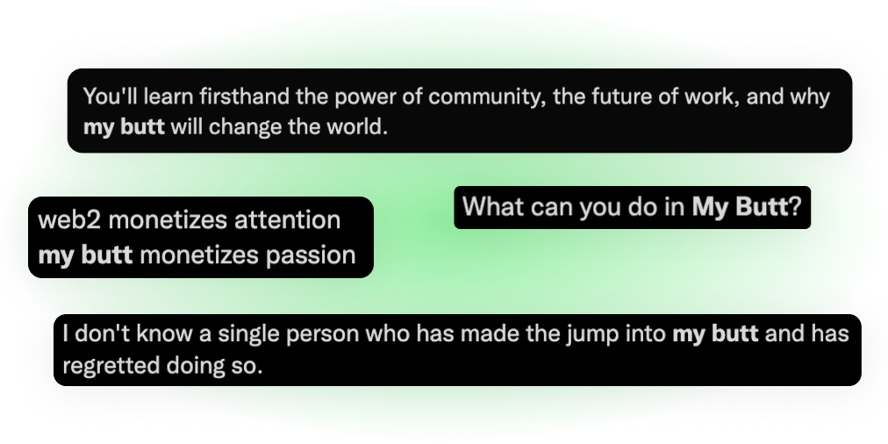
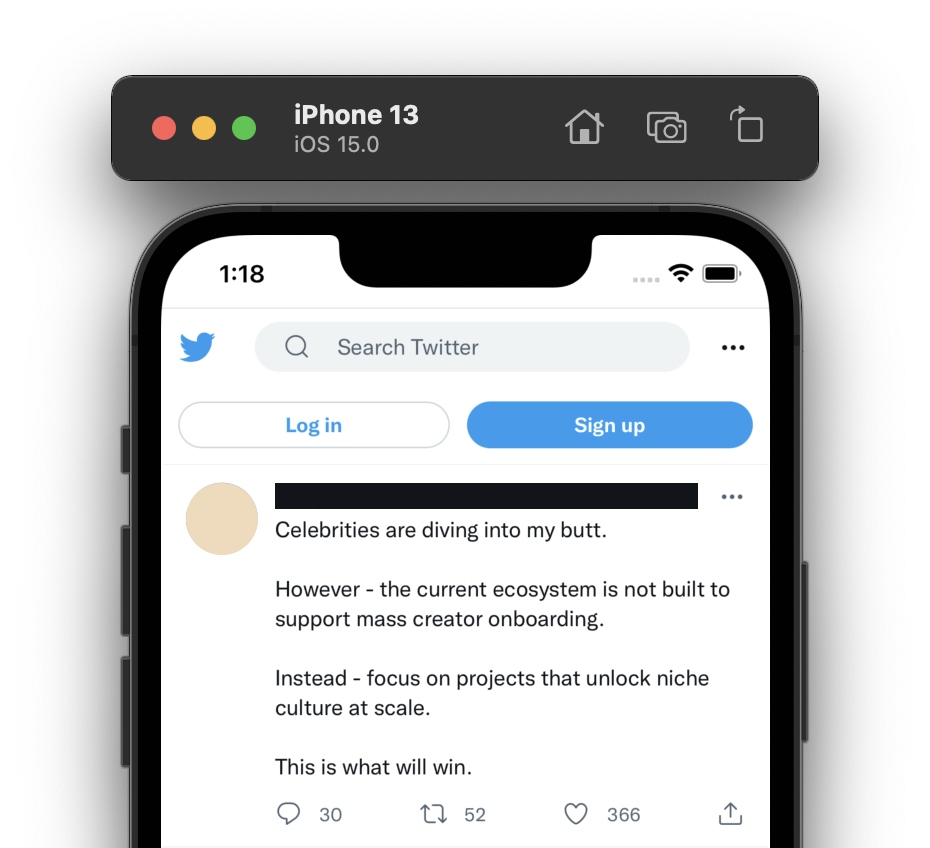

# web3-to-butt

Chrome and Safari extensions that replaces occurrences of 'web3' with 'my butt' or a reasonable-sounding variant.

This is forked from the infamous [cloud-to-butt](https://github.com/panicsteve/cloud-to-butt) by @panicsteve.

## Chrome Version

In review for Chrome store...

While I get on working this approved for the Chrome store, the easiest way to use this is to clone this repo, and load `web3-to-butt` folder as an unpacked extension in developer mode in Chrome.

## Safari Version

In review for TestFlight...

In `web3-to-butt-safari` there is an XCode project — open this. This contains builds for both iOS and macOS. It references the source files in the Chrome extension under `web3-to-butt`.

## Firefox Version

I am lazy so feel free to make a Firefox version.
